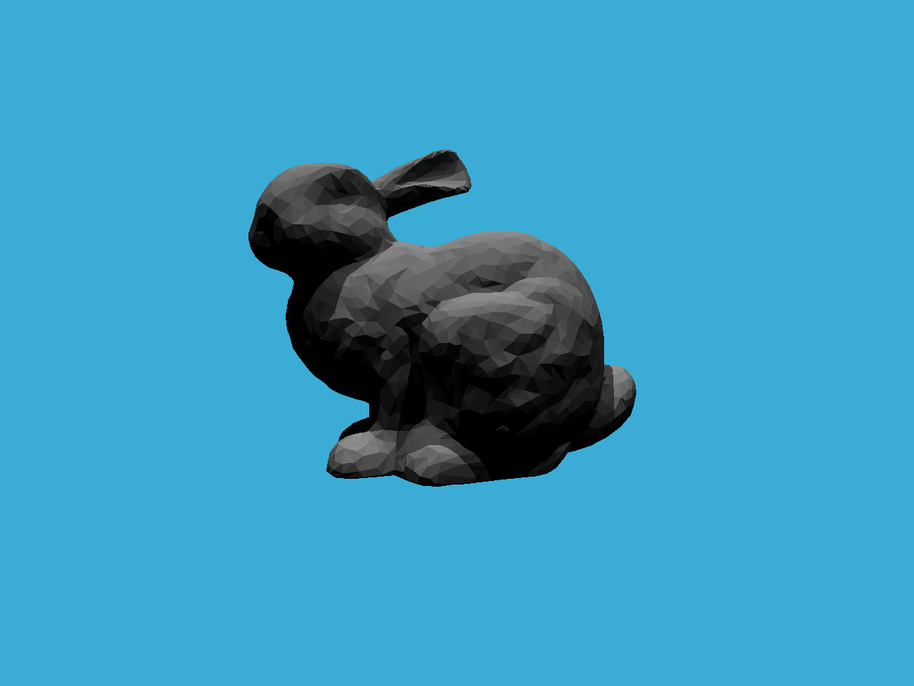
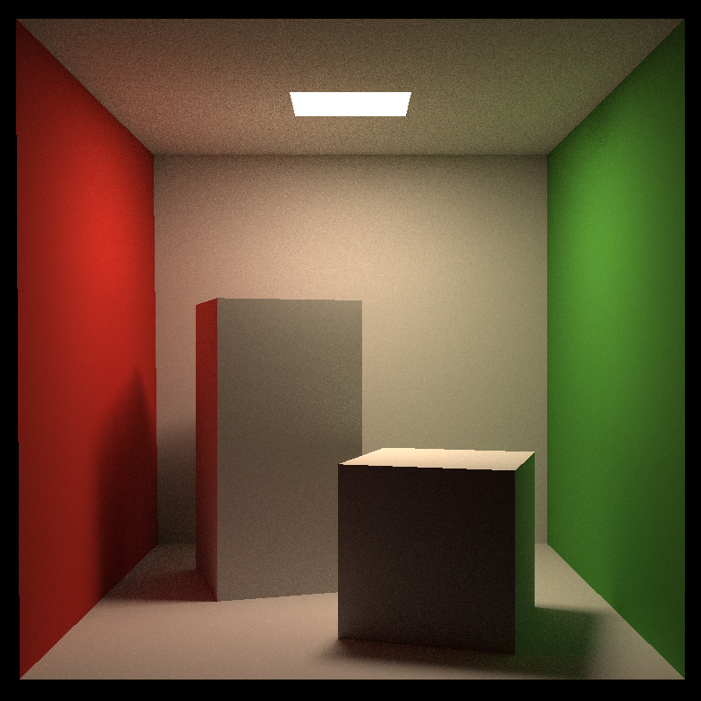
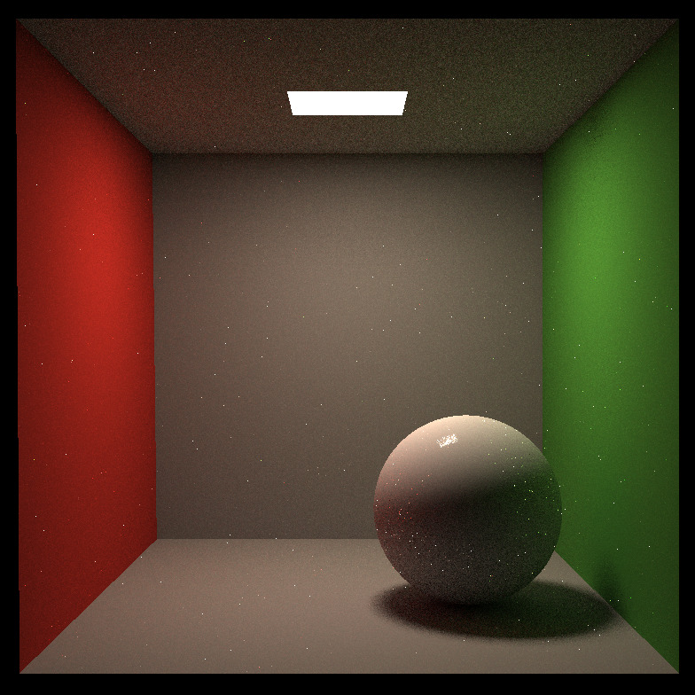
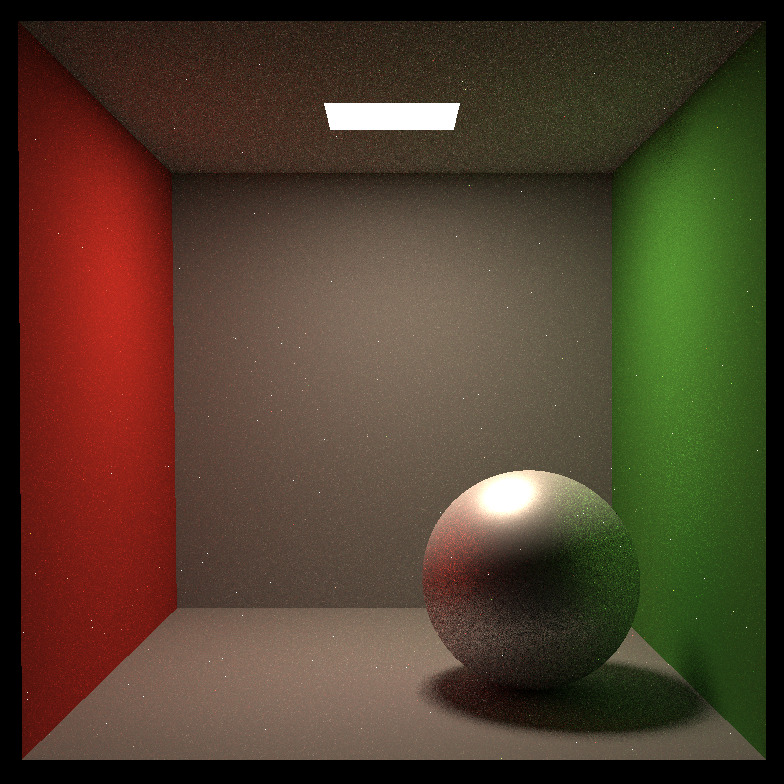
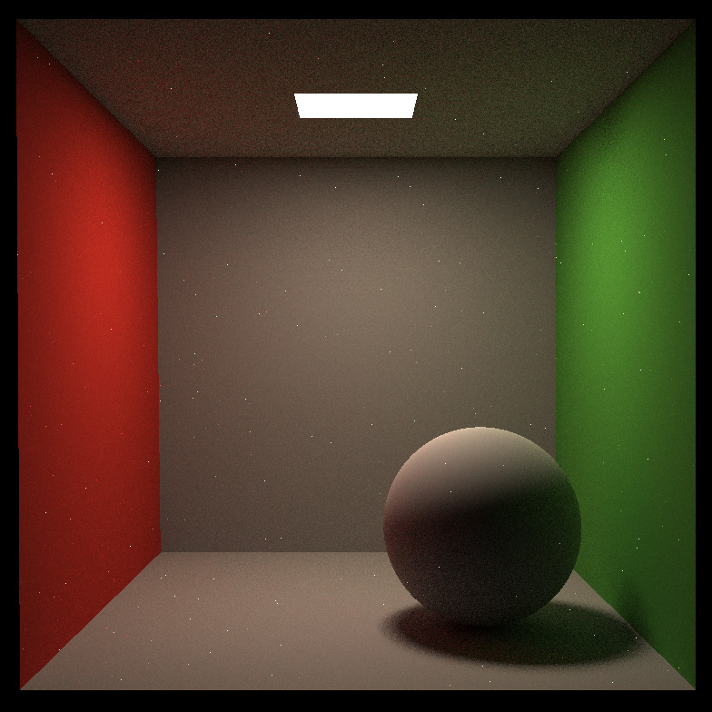

# GAMES101-Homework
GAMES101课程作业合集，包括作业pdf和代码框架。

Noticed that I only finish the ray-tracing part, which is Assignment 5-7.

Assignment 5: whitted-style ray-triangle intersection
Assignment 6: bvh accerated ray-tracing

Assignment 7: path-tracing + cook-torrance brdf

path-tracing:

Cook-torrance brdf:
Mirror (roughness = 0)

Silver

Rough surface

